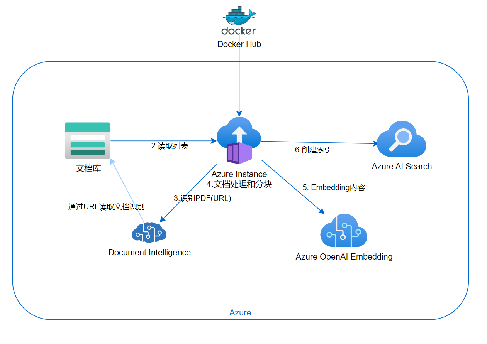

# 远程构建Azure AI Search Index

参考 https://github.com/radezheng/ai-search-demo-guide
<br/>
部署完之后，会将data目录下的文档构建index, 但当pdf文件比较大, 比较多的时候，容易超时或出错。这时候可以使用远程构建的方式，将pdf文件上传到Azure Blob Storage，然后通过Azure Container Instance 触发构建触发Document Intelligence的通过URL 识别的操作。



## 准备环境信息
需要准备以下服务:
- Azure Storage Account
- Azure OpenAI Embedding 模型部署好
- Azure AI Search
- Azure Docuemnt Intelligence 

然后将相关信息放到.env 文件中，如下所示:
```bash
cp .env-example .env
```
打开.env 文件，填入相关信息
```ini

#Document Intelligence 服务名称(不是endpoint)
AZURE_FORMRECOGNIZER_SERVICE="xxx"
AZURE_FORMRECOGNIZER_SERVICE_KEY="xxx"
#所在区域
AZURE_LOCATION="japaneast"

#Azure OpenAI 相关信息，https://portal.azure.com
AZURE_OPENAI_SERVICE="xxx"
OPENAI_API_KEY="xxx"
#embeddings 模型部署名称 https://oai.azure.com
AZURE_OPENAI_EMB_DEPLOYMENT="xxx"
#embeddings 模型名称，不用改
AZURE_OPENAI_EMB_MODEL_NAME="text-embedding-ada-002"
OPENAI_HOST="azure"


#azure ai search 相关信息
#服务名称, 不是endpoint
AZURE_SEARCH_SERVICE="xxx"
AZURE_SEARCH_SERVICE_ADMIN_KEY="xxx"
#索引名称，可以不改。如果不存在会自动创建。不要手动创建。
AZURE_SEARCH_INDEX="gptkbindex-aci"
#如下三项不用改，对中文支持。
AZURE_SEARCH_ANALYZER_NAME="zh-Hans.lucene"
AZURE_SEARCH_QUERY_LANGUAGE="zh-CN"
AZURE_SEARCH_QUERY_SPELLER="none"

#azure storage account相关信息
#storage account 名称, 不是endpoint
AZURE_STORAGE_ACCOUNT="xxx"
AZURE_STORAGE_CONTAINER="xxx"
AZURE_STORAGE_ACCOUNT_KEY="xxx"
AZURE_SUBSCRIPTION_ID="xxx"

#在azure portal 上可以看到，Entra ID
AZURE_TENANT_ID="xxx"
AZURE_USE_AUTHENTICATION="false"

```

## 运行
将相关文件上传到Azure Blob Storage的container下，然后运行如下命令:
```bash

#shell version
RESOURCE_GROUP="predoc_url"
CONTAINER_NAME="predoc-url"
DNS_NAME_LABEL="predoc-url-111"
#azure container instance建在哪个区域

LOCATION="japaneast"
az group create --name $RESOURCE_GROUP --location $LOCATION
# run azure container instance with the image and .env file in region japaneast, run once only.

az container create --resource-group $RESOURCE_GROUP --name $CONTAINER_NAME --image radezheng/predoc_url --dns-name-label $DNS_NAME_LABEL --ports 80 --cpu 1 --memory 1 --location $LOCATION --environment-variables $(cat .env | xargs)


echo $(cat .env | xargs)
#get the log
az container logs --resource-group $RESOURCE_GROUP --name $CONTAINER_NAME

#stream the log
az container attach --resource-group $RESOURCE_GROUP --name $CONTAINER_NAME
```

运行完之后，会在Azure AI Search 中看到index已经构建好了。